This chapter contains information about:

- where we store data and how to access it
- options for transferring data between machines
- how we run analyses on UCSB's HPC clusters
- best practices for using git repositories collaboratively

## Data Storage

We store our inpute data and workflow outputs on UCSB's GRIT server NextCloud. We pay per TB/year for this storage, so we're mindful to not unnecessarily store old data there indefinitely. "Data" here includes database files, CSVs, model files, etc. but not word documents or PDFs that contain written materials for project proposals or manuscript drafts. Those project documents are stored in the project's Google Drive.

The rule of thumb for database files and sets of results and intermediate data products is to only store the current and most recent versions, and delete the older versions. Database filenames include the date they were generated with the format `YYYYMMDD` that is associated with a git commit or repo release on that same date. Releases are reserved for database versions that serve as input into an analysis. These may also be associated with Docker images in the future. 

Each directory includes a `README.md` describing the contents. This file should be downloaded, updated, and uploaded with any changes to the contents. 

**Data encryption:** Data in transit is encrypted using industry-standard TLS (HTTPS/SSH/WebDAVS), ensuring that information cannot be read or altered while being transmitted over the network.

**Access control:** Access to the server is restricted to authenticated users only. Authentication is handled via individual user accounts, backed by Active Directory and single sign on via Authentik. Role-based access controls (RBAC) are used to ensure users can only access data and services appropriate to their role. Administrative access is limited to a small number of authorized operators and requires elevated privileges.

**Network security:** The server is protected by firewall rules that restrict inbound and outbound traffic to only required services and trusted networks. Remote access is limited to secure protocols like HTTPS, SSH and WebDAVS.

**Auditability and monitoring:** User actions and system activity are logged to provide audit trails for security and operational review. Monitoring tools are used to detect abnormal behavior, failed login attempts, or service disruptions.

**Operational security:** The system is regularly updated with security patches. Backups are performed hourly to protect against data loss, with access to backups restricted to authorized administrators only. Backups are kept on GRIT owned and managed equipment. 

**Backups:** Hourly snapshots of the data are taken and the storage / snapshot stream is replicated to another server in a different datacenter on campus for redundancy.

**Communication** In order to communicate with the GRIT / NextCloud team, open a ticket on [Zammad](https://zammad.grit.ucsb.edu/#ticket/view/my_tickets).

## Accessing Nextcloud Storage via the browser

This is the simplest way to access the data and is sufficient for uploading and downloading small amounts of data or a few files.

[https://nextcloud.grit.ucsb.edu/index.php/apps/files/files](https://nextcloud.grit.ucsb.edu/index.php/apps/files/files)

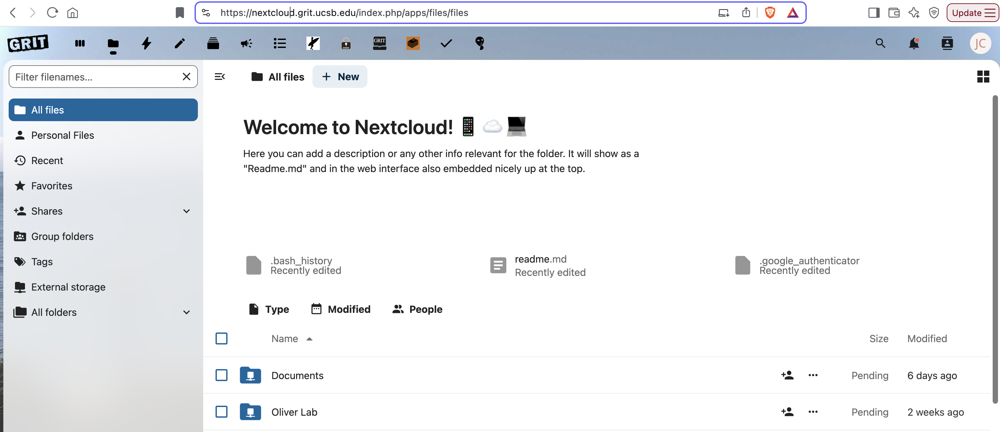

For larger data downloads to your laptop, use the command line (see SSH instructions in the next section). Use the [Globus](https://www.globus.org/) website or Globus command line tool if transferring a large amount of data between UCSB and Smithsonian institutions (see Globus section below).

## Set up SSH key pairs

**SSH** refers to "secure shell", which is a network protocol that establishes encrypted connections between machines for remote access.

SSH key pairs are two files you generate on your machine that authenticate you on another machine via encryption and then decryption: one file is only stored locally, and the other is your "public" key that you upload to the destination server.

A few things to note: 

- SSH keys are optional on many servers, but required for others like GRIT. When they are optional, you can alternatively login by being prompted for your password in your IDE.

- An extra step of creating a passkey for your authentication is optional (it's an extra layer of security). When you are prompted for this, your password is hidden. 

- When you SSH to the destination server, the encryption & decryption of the key files authenticates you.

### Generate a key pair

[ssh-keygen man page](https://man7.org/linux/man-pages/man1/ssh-keygen.1.html)

Generate a key pair on your source machine (laptop or server).

- The string portion will be tagged onto the end of the public key, insert something that will help the destination server admins attribute this key to you, like your email. (`-C` = "comment")

- The "ed25519" part represents the algorithm used to generate the key: Edwards-curve Digital Signature Algorithm. It's newer and stronger than old algorithms like "RSA", produces smaller keys, generates keys faster, and importantly is supported by both Linux and Mac.

```bash
cd ~
ssh-keygen -t ed25519 -C "some_string"
```

2 files are generated: `~/.ssh/id_ed25519` and `~/.ssh/id_ed25519.pub`

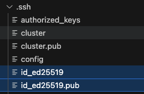

You can use the same key pair for multiple destination machines, making it easier to manage because you don't have to keep track of each pair, but this also poses more of a risk if it's compromised.

If you get an output saying you already have a key with that name, you can save it to a different directory (it may prompt you to enter a new location that by default is `~`) and then just rename it and move it to the `.ssh` dir. 

### Upload the public key

For GRIT, upload your pub key through [this form.](https://selfservice.grit.ucsb.edu/?action=changesshkey)

Normally, you would be responsible for uploading the **public** key to the server yourself with this command:

```bash
ssh-copy-id -i ~/.ssh/id_ed25519_vscode.pub username@remote.server.edu
```

This command does not generate a new file on the destination server, it just adds a line to the `~/.ssh/authorized_keys` file. Then on your local machine, you would add this host to your IDE config so it looks like this:

```
Host server_name.cnsi.ucsb.edu
  HostName server_name.cnsi.ucsb.edu
  User your_username
  IdentityFile ~/.ssh/id_ed25519_name_of_file
```

Now you will be able to SSH in the command line with just `ssh server_name.cnsi.ucsb.edu` and just select the remote hostname in your IDE without typing in a password.

### Ensure correct permissions

Ensure you have the right directory and file permissions set. The `~/.ssh` directory should be private, and the private key file itself should be readable and writable only by you. The public key should be readable by everyone.

```bash
chmod 700 ~/.ssh                  # only owner can access (rw-------)
chmod 600 ~/.ssh/id_ed25519       # only readable, writable, and executable by me (rwx------)
chmod 644 ~/.ssh/id_ed25519.pub   # readable by everyone (rw-r--r--)
```

SSH will refuse insecure keys. If you get a permission denied error, it is likely that the directory or file permissions are too open. SSH is looking out for you! Here's an example of this error message:

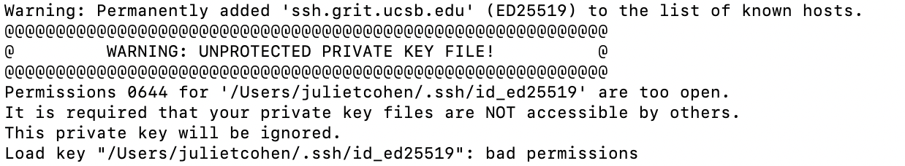

### Understanding user permissions

User, group, and other have permissions outlined when you run `ls -al`.

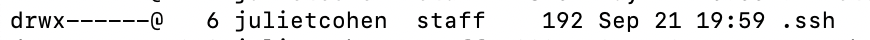

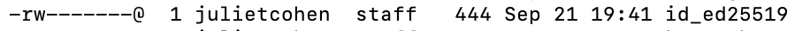

The first character designates it as a file (`-`) or directory (`d`). After the first character, the following 3 are the user permissions, the next 3 are the group permissions, and the last 3 are the permissions for other. 

r = "read", w = "write", x = "execute" (run script)

**If you have private data stored on a UCSB server like pod, you also need to make sure your data directory has these owner-only `chmod 700` permissions!**

## Access Nextcloud Storage via SSH

Specify the local key file within the command.

```bash
ssh -i ~/.ssh/id_ed25519 username@ssh.grit.ucsb.edu
```

- Access destination directories `username@ssh.grit.ucsb.edu:/home/oliver-lab` or `username@ssh.grit.ucsb.edu:/home/username`
- If you set up a passkey when you generated the key pair, you will be prompted to enter it
- The first time, seeing a warning "The authenticity of host can't be established" is not reason for concern. Continue logging in. 
- There are several other SSH endpoints within GRIT, but this is the only one that works for me. I expect more to work over time.

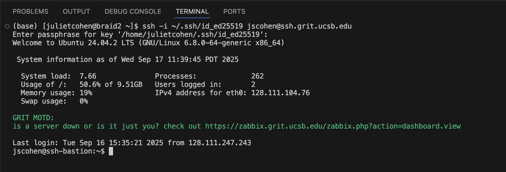

In order to break the connection, kill the terminal or use the `exit` command.


### tmux

It's always wise to use a persistent shell when making transfers a large amount of data or files.

[tmux cheat sheet](https://tmuxcheatsheet.com/)

You can name your tmux sessions, but the default name for a session is "0"

```bash
tmux
tmux ls
tmux attach -t 0
tmux kill-session -t 0
```

A tmux terminal is designated by a green bar at the bottom:

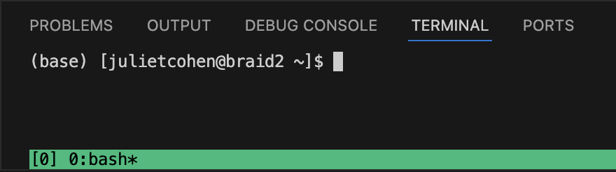

Note: If you do not use a tmux session and your terminal is killed midway through an rsync, the process will abort. But you can just run the same rsync command again and it will pick up where it left off, checking that some files were already transferred. 

### rsync

See the Options Summary section of the [man page](https://linux.die.net/man/1/rsync)

- When making transfers within the same machine, common to use `-a` archive mode, which is a combination of multiple options: `-rlptgoD`
  - `-r` recursive, use when transferring a directory hierarchy
  - `-l` copy symlinks as symlinks
  - `-p` preserve permissions
  - `-t` preserve timestamps (good practice)
  - `-g` preserve group
  - `-o` preserve owner
  - `-D` copies device files as such (like those in `/dev` directories) and preserve special files, not necessary for our purposes
- Include `-z` for compression
- Include `--dry-run` when want to see what will be transferred before executing. 
- Include `-v` for verbose if you want to see what is being copied in real time.
- When specifying the source directory, including a trailing slash will transfer everything *within* the directory but not the top level dir. Usually we want to transfer the top level dir, so omit the trailing slash.
- Ensure the quotes are not fancy. Re-type the quotes before running the rsync command if copied the command from another text editor.
- When using an SSH key pair, include the filename for the file in the command so rsync knows where to pull from. 

```bash
rsync -tvr -e "ssh -i ~/.ssh/id_ed25519" safegraph jscohen@ssh.grit.ucsb.edu:/home/oliver-lab/covid/covid-raw-data/
```

### Globus

Use the Globus website or command line tool to transfer large amounts of data from UCSB to Smithsonian's server, which has set up a guest collection. If using the browser, you will need to log in to both institutions, so you're most likely going to use the command line tool to initiate a transfer and then use the browser simply to monitor its progress with the Activity tab since it is prettier and more straight-forward than monitoring in the terminal. You will need to get Smithsonian's public Mapped Collection name to retrieve the UUID (a long string of numbers and letters). Prior to the transfer, your collaborator at Smithsonian will need to grant read & write permission to your email. We achieved this by granting permission to both the USCB email and the globus email. Juliet Cohen's globus email looks like this: `jcohen3@access-ci.org` (Juliet did not choose this username, it was generated for her, so you'll have yo look up yours without assuming that it matches your UCSB username)

- Retrieve this UUID with the collection name by running `globus endpoint search "{ENDPOINT_NAME}"` (Your Smithsonian collaborator may need to provide you with read & write permissions)
- Create a conda environment with the `globus` tool. 
- Initiate the transfer in a `tmux` session. Note that the source is coming from root `/julietcohen` not `/home/julietcohen` and the destination at the endpoint is also root.

`globus transfer {UUID_of_UCSB_endpoint}:/julietcohen/repositories/mortality-behavior/output/data-products {UUID_of_Smithsonian_endpoint}:/`

- That command results in a URL to log in to globus and grant access. This step may then transfer you to a CSC login page and that may result in an error even with valid credentials. This was my experience the first time. Retry the same command and log in process and it should work. At this point a globus task has been initiated. You can verify this with `globus task list` in the command line or the Activity tab in the globus browser.

### Small data transfers in the command line

Transfer a local file called `data.txt` to a server where you have set up a key pair:

`scp -i ~/.ssh/id_ed25519 ./data.txt user@server:/remote/path/`

Tranfer an entire directory:

`scp -i ~/.ssh/id_ed25519 -r ./data_dir user@server:/remote/path/`

### Check directory and file contents

Check number of files in a directory, recursively

```bash
find directory_name -type f | wc -l
```

Check number of bytes in a directory, summing up all files recursively, auto-scaling the bytes to human readable format (MB, GB, etc.). Note that this number can vary slightly accross machines with the same data due to metadata overhead.

```bash
du -sh directory_name
```

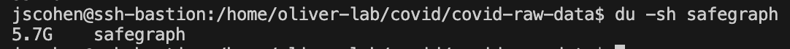

Check if files are identical using SHA256 checksums (string that uniquely represents file contents).

```bash
sha256 file1.txt file2.txt
```

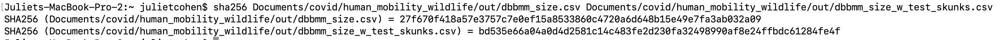

Check if files are identical by comparing bytes. No output means they are the same.

```bash
cmp file1.txt file2.txt
```

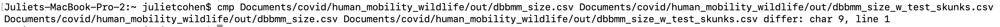

## Aliases

Commands you run often can be made into a shortcut. This is simply a line added to your `~/.bashrc` script:

```bash
alias myalias="command_to_execute"
```

Then open a new terminal so the `.bashrc` script is loaded.


I created an alias for my SSH login to grit:
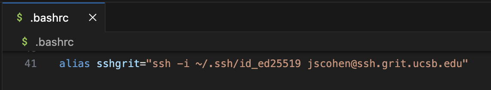

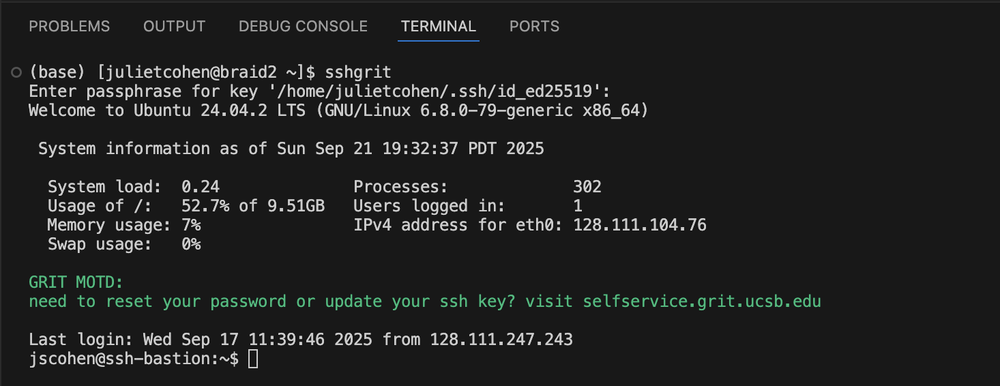

## Commands on servers for HPC jobs

| Command |	Use |
| -------- | ------- |
| `ssh {username}@pod-login1.cnsi.ucsb.edu` | login to pod server |
| `salloc -p batch -t 03:00:00 --mem=30G` or `srun --pty bash -i` | 	run in a tmux session, launch an interactive job on a normal memory node for 3 hours with 30 GB memory |
| `sbatch script.sh` 	| launch a non-interactive job on a normal memory node (add to the queue) |
| `sbatch -p largemem script.sh` |	launch a non-interactive job on a high memory node (add to the queue) |
| `squeue -u {username}` |	print information regarding requested jobs such as JOBID, NAME, NODES, etc. |
| `squeue -j {job ID} --format="%i %l %M"` | show how much time is left in a job |
| `ssh node48` 	| open terminal in the appropriate node number |
| `scontrol show job {jobID}` |	show detailed info about your job, such as endtime |
| `top -u {username}` |	show node memory usage and only your processes, with %MEM column showing each process's memory usage (htop is not available on Pod) |
| `module load R/4.1.3 gdal/2.2.3 proj/5.2` | load modules in one of the terminals on the job node |
| `R` |	open R module in terminal |
| `q()` | 	exit out of R module, switch `wd` to `~` |
| `sinfo -o "%n %m"` 	| shows the total amount of memory per node for all nodes on the server |
| `sinfo -o "%n %m %C" | awk '$2 >= 512000'` |	shows the core availability of each node that has at least 500 GB |

## Recommended git repository structure

To keep filepaths consistent, we recommend using the following directory structure in your analysis repositories:

```
├── data/ raw input data
├── code/ all code
│   └── functions/ custom functions
│   └── dev/ scratchpad for developing analysis scripts
│   └── workflow/ finalized analysis scripts
│   └── hpc/ slurm scripts
├── output/ all output from code
│   └── data-products/ any intermediate data or model outputs
│   └── figures-dev/ figures created while developing analysis scripts
│   └── figures-workflow/ figures created from finalized analysis scripts
├── results-summary.qmd document summarize key results for manuscript 
├── README.md  
├── .gitignore
```

## Git repository best practices

- Write descriptive commit messages. Commit and push often.
- Use repository issues to track to-do items and investigate bugs. Tag team members, directly link to other issue comments, add custom labels, and create sub-issues as needed.
- Use repository releases to snapshot your code and easily associate with a set of results. Add a README to the release to describe changes from the previous release and link to publicly published input data.
- Use project boards as you collaborate on projects to track priorities and distribute issues to different team members. 
- Use branches and pull requests to make incremental changes to the codebase. Merge small updates frequently. Pull changes from main into your branch before merging a branch into main.
- Resolve merge conflicts in the command line whenever possible. The github user interface for resolving conflicts can be annoying depending on which branch was used as the base branch and the direction you are merging.
- Do not push input data or large output files to the remote repositories. Use the `.gitignore` wisely! Figures and images for READMEs can usually be tolerated in the remote as these are small.
- Archive your development environment. Build Docker images, push built images to DockerHub, and pull images/run containers on UCSB servers with Apptainer. See [this repository](https://github.com/ryoliver-lab/wildlife-movement-anno) as an example of a containerized workflow. Use mounted volumes for adding input data and writing output data.

